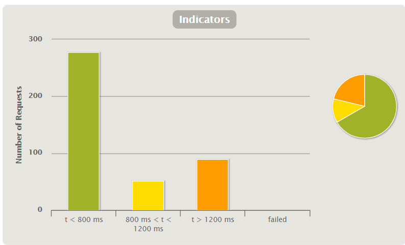
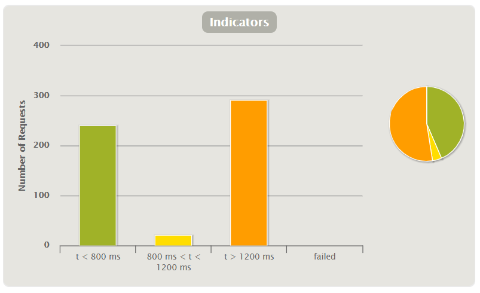
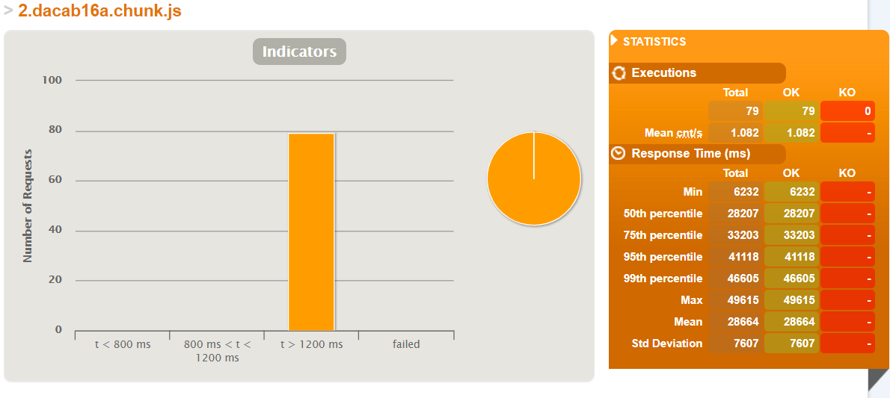

[[section-anexos]]
== Anexos

=== Pruebas
:numbered!:

Se realizaron varios tipos de pruebas, tanto de las aplicaciones web y móvil, como de la API Rest: 

==== Apliación web

===== Pruebas unitarias 

===== Pruebas de aceptación 

====== Visualización de la lista de amigos. 

* Esecenario: El usuario no está registrado en la aplicación web y quiere ver una lista con sus amigos.

* Dado: Un usuario no registrado.

* Cuando: El usuario se registra en la aplicación. 

* Después: El usuario accede a la lista de amigos y visualiza todos sus amigos. 

===== Pruebas de carga 

Hemos realizado dos pruebas de carga para comprobar como responde el servidor de la aplicación bajo diferentes cantidades de usuarios simultáneos. Estas pruebas simulan la descarga de la página y la consulta de las peticiones de los amigos.

En la primera simulamos 60 usuarios accediendo a la página durante un minuto. Los resultados generales fueron los siguientes:

Los resultados de esta prueba fueron bastante buenos, ya que la mayoría de peticiones tardaron menos de 800 ms.

En la segunda prueba simulamos 2 usuarios accediendo a la página cada segundo, durante 30 segundos. Los resultaods obtenidos fueron estos:

En este caso los resultados no fueron los deseados, pero pudimos comprobar que el cuello de botella se encuentra en la descarga de este archivo JavaScript de 2 MB que contiene el código de las librerías externas utilizadas:

Sin embargo, no fuimos capaces de reducir este archivo, ya que la mayor parte de su tamaño estaba ocupado por las librerías para acceder a Solid, y estas son indispensables para cumplir los requisitos de la arquitectura.

==== Aplicación movil

===== Pruebas unitarias

Hemos hecho pruebas sobre los siguientes aspectos de la aplicación:

* Gestión de amigos:
    - Se pueden actualizar correctamente los amigos cercanos al usuario.
    - Se muestran correctamente las notificaciones de amigos cercanos.
    - Los usuarios vetados no pueden consultar sus amigos.
* Gestión de localizaciones del usuario:
    - Las localizaciones se envían correctamente.
    - Un usuario vetado no puede enviar su ubicación.
* Inicio y cierre de sesión:
    - Un usuario con credenciales válidas puede iniciar sesión.
    - Un usuario con credenciales inválidas no puede iniciar sesión.
    - Un usuario vetado no puede iniciar sesión.
    - Un usuario que ha iniciado sesión puede cerrarla.

Con estas pruebas hemos comprobado el correcto funcionamiento de las dos funcionalidades principales de la aplicación móvil: el envío de localizaciones del usuario y la recepción de notificaciones de amigos cercanos. También hemos comprobado el correcto comportamiento del inicio de sesión, ya que fue un aspecto que dio bastantes complicaciones (véase ADR 3).

Además, comprobamos la seguridad de la aplicación, garantizando que un usuario no pueda iniciar sesión con credenciales inválidas y que un usuario vetado no pueda hacer uso de la aplicación.

===== Pruebas de snapshot

También hicimos pruebas de snapshot sobre algunas pantallas de la aplicación:

* Vista general de la aplicación.
* Vista de inicio de sesión.
* Vista de usuario en sesión.

Con estas pruebas evitamos cambios accidentales en las vistas de la aplicación.

==== API Rest

===== Pruebas unitarias 

Hemos hecho las siguientes pruebas sobre los usuarios y los amigos:

* Usuarios:
    - Se pueden crear.
    - Se pueden actualizar.
    - No se pueden actualizar desde fuentes no autorizadas.
    - No se pueden actualizar si han sido vetados.
* Amigos:
    - Se pueden listar.
    - Se pueden listar los cercanos a una ubicación.
    - No se pueden listar los cercanos a una ubicación desde una fuente no autorizada.

Con estas pruebas comprobamos que la API Rest accediese correctamente a la base da datos y a los PODs, y que combinase los resultados adecuadamente para enviárselos al usuario. También comprobamos la seguridad de la API Rest, evitando accesos de usuario no autorizados (véase ADR 5) y de usuarios vetados.

:numbered:
